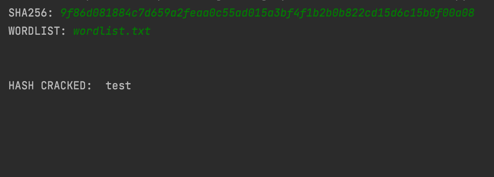

# CRACKSHA256
Script that uses wordlist to decode given hash. Start the script, input hash and wordlist, then click enter.<br/>
<br/>


# Usage
1. Run the script with:
```
python3 CRACKSHA256
```
2. Input SHA256 hash
3. Input wordlist
4. Correct word will be displayed if it is included in wordlist

# Legal
Developer assume no liability and are not responsible for any misuse or damage caused by CRACKSHA256. Only use for educational purposes!

# Author
Filip Rokita<br/>
www.filiprokita.com
